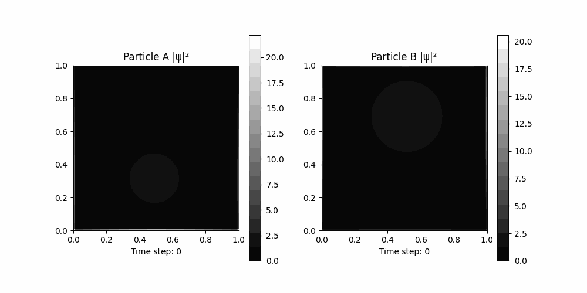

This is how we created a Physics Informed Neural Network that simulates the behavior of two quantum particles in an isolated two dimentional system.
<break>
following is an example of the particles we simulated to train this neural network on.

The following properties are obeyed by the generated data:
1. All particles have constant mass and the sum of there probabilities inside the square region is 1, outside is 0.
2. the walls of the system are perfectly reflective thus forcing the particles to remain inside the system.
